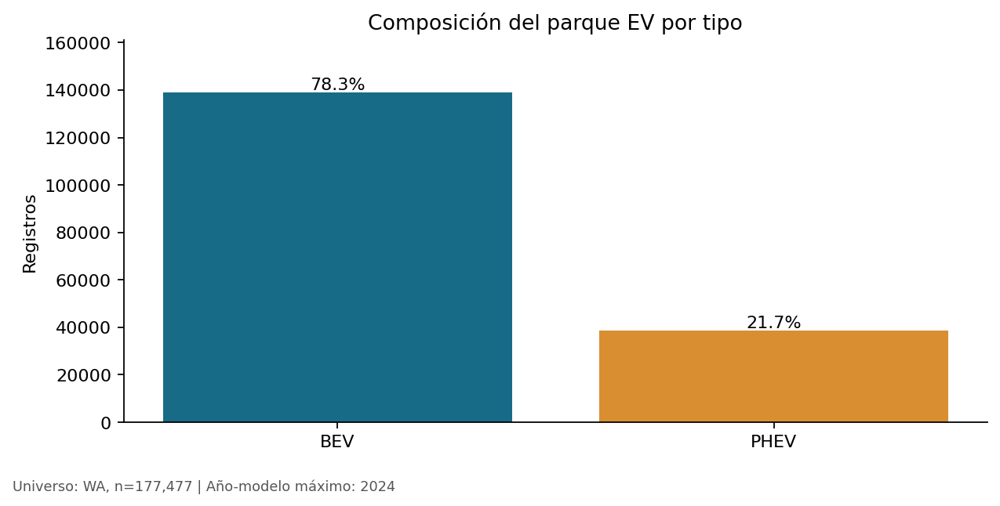
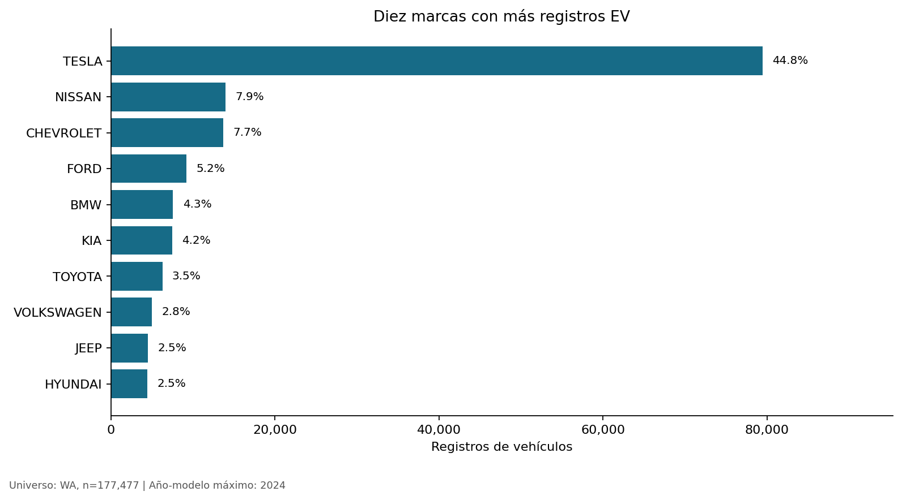
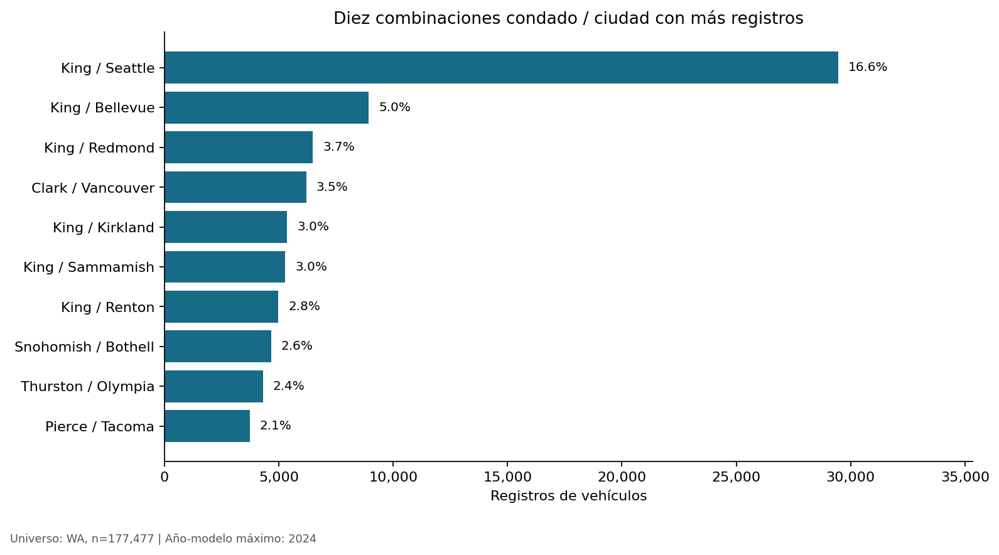

# Vehículos eléctricos en Washington

**Composición del parque y concentración geográfica para explorar servicios posventa.**

Análisis descriptivo con Python de **177,477 registros de vehículos ubicados en Washington**, orientado a identificar zonas y segmentos para investigar oportunidades de mantenimiento especializado y servicios posventa.

## Pregunta de negocio

¿Qué zonas y segmentos del parque eléctrico de Washington conviene investigar primero para planificar servicios posventa y soporte operativo?

## Resultados principales

| Indicador | Resultado |
|---|---:|
| Registros originales | 177,866 |
| Registros incluidos: State = WA | 177,477 |
| Participación de Tesla dentro del conjunto WA | 44.78% |
| Vehículos totalmente eléctricos (BEV) | 78.29% |
| Híbridos enchufables (PHEV) | 21.71% |
| Registros en King / Seattle | 29,447 (16.59%) |
| Registros con autonomía positiva | 48.28% |
| Registros con precio base positivo | 1.88% |

Tesla Model Y y Model 3 encabezan los modelos con 35,921 y 30,009 registros. King/Seattle, King/Bellevue y King/Redmond son las combinaciones condado–ciudad con más registros.

Estas cifras describen el archivo analizado: **no son ventas anuales ni participaciones dentro de todo el mercado automotriz**.

## Visualizaciones







## Método

1. Carga del CSV preservando códigos e identificadores como texto.
2. Validación de esquema, valores numéricos, duplicados exactos e identificadores de vehículos.
3. Delimitación geográfica: State = WA; exclusión de 389 registros externos al alcance.
4. Conservación de faltantes cuando no impiden el análisis, sin imputar distritos mediante la mediana.
5. Separación de ceros de autonomía y precio de las mediciones disponibles, preservando los campos originales.
6. Análisis por tipo, marca, modelo, territorio y año-modelo; exportación de tablas y figuras.

## Implicaciones operativas

La concentración observada permite seleccionar Seattle, Bellevue y Redmond para investigar servicios posventa. Para decidir una inversión se requieren datos de competencia, necesidades de mantenimiento, costos y uso de vehículos. La cantidad de EV por sí sola no permite determinar rentabilidad o déficit de cargadores.

## Limitaciones

- Fecha exacta de corte no disponible; el archivo contiene años-modelo hasta 2024.
- El año-modelo no es la fecha de venta o registro. Las diferencias entre grupos no representan crecimiento anual de adopción.
- El universo contiene BEV y PHEV, no vehículos convencionales ni híbridos no enchufables.
- La penetración territorial requiere el total de vehículos registrados en cada territorio y fechas comparables.
- La cobertura de autonomía y precio es desigual; los subconjuntos disponibles no representan automáticamente todo el parque.
- Cualquier extrapolación por año-modelo incluida como ejercicio exploratorio en el notebook no constituye un pronóstico validado de ventas ni una estimación de registros faltantes.

## Herramientas

Python · pandas · NumPy · Matplotlib · Jupyter/Colab

## Consultar el análisis

[Notebook con código, resultados y comentarios](washington_ev_population_analysis.ipynb) · [Descripción y procedencia de los datos](data/README.md)

## Ejecutar localmente

Desde la carpeta raíz del proyecto, con Python instalado:

```bash
python3 -m venv .venv
source .venv/bin/activate
python -m pip install -r requirements.txt
python -m pip install jupyterlab
python -m jupyterlab
```

En Windows, activa el entorno con `.venv\Scripts\activate`.

Coloca la copia original del CSV en `data/electric_vehicle_population.csv`. Abre el notebook y ejecuta las celdas desde el inicio. Las rutas están definidas para ejecutar desde la raíz del proyecto. Las figuras y tablas se guardan en `reports/`.

Las versiones de `requirements.txt` corresponden al entorno de verificación. Se incluye scikit-learn para el ejercicio exploratorio de sensibilidad: 42,451 registros al ajustar 2015–2023 y 65,504 al ajustar 2020–2023. Estas extrapolaciones no son pronósticos validados de ventas.

## Ejecutar en Colab

Sube el notebook a Colab y el CSV como `electric_vehicle_population.csv` a `/content/`. El notebook técnico admite el CSV junto al notebook o dentro de `data/`. Ejecuta todas las celdas en orden y descarga el notebook con sus salidas guardadas si haces cambios.

## Fuente y contexto

Fuente original de referencia: [Washington Department of Licensing — Electric Vehicle Population Data](https://catalog.data.gov/dataset/electric-vehicle-population-data).

Se trabaja con una copia histórica proporcionada por el autor. Descargar la versión actual de la fuente no reproduce necesariamente estas cifras. El proyecto se desarrolló a partir de un ejercicio formativo y se revisó para enfocar el análisis en calidad de datos e implicaciones operativas.
